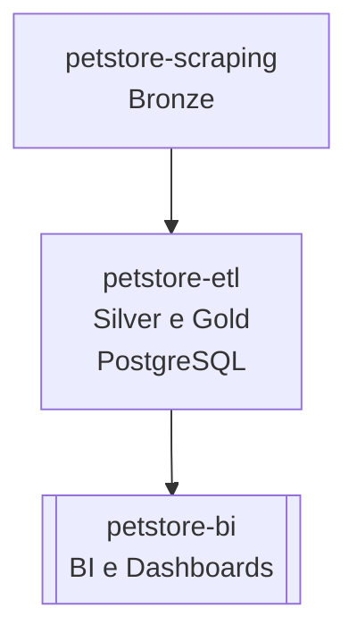

# 🐾 petstore-bi

Projeto responsável pela **análise e visualização de dados** de lojas e franquias do setor pet.

Esta etapa consome os dados Gold armazenados em um banco de dados PostgreSQL e processados pelo repositório [`petstore-etl`](https://github.com/rafa-trindade/petstore-etl) permitindo a análise da distribuição das lojas, identificação de lacunas de cobertura e monitoramento do potencial de expansão.

---

## 📌 Descrição

O `petstore-bi` consome os dados finais (Gold) gerados pelo `petstore-etl` e realiza:

* **Análise descritiva:** exploração detalhada da distribuição das lojas por cidade, estado e franquia, identificando concentrações geográficas, lacunas de cobertura e oportunidades de expansão. Incluir métricas como densidade regional de lojas, distância média entre unidades e representatividade por estado.
* **Visualizações e dashboards:** criação painéis interativos e mapas geoespaciais que permitam o monitoramento da presença das franquias, a comparação entre regiões e a análise do potencial de mercado não explorado.
* **Integração com pipelines analíticos:** integração automatizada entre as etapas de extração, transformação e visualização, garantindo atualizações contínuas dos dados e a geração de relatórios dinâmicos. Essa estrutura permitirá análises recorrentes de desempenho regional e suporte à tomada de decisão sobre expansão territorial.

---

## 📊 Estrutura dos Dados e Metadados

O projeto inicia com as colunas abaixo, contendo dados  de endereços oriundos do projeto [`petstore-etl`](https://github.com/rafa-trindade/petstore-etl) carregados no PostgreSQL, que serão enriquecidos progressivamente com informações geográficas e analíticas para suporte a decisões de expansão.

| Coluna        | Tipo   | Descrição                   | Valores possíveis / Observações | Unidade | Camada          | Origem      | Última Atualização |
| ------------- | ------ | --------------------------- | ------------------------------- | ------- | --------------- | ----------- | ------------------ |
| id            | string | Identificador único da loja | Sequencial (autoincrement)      | -       | Silver / Gold   | PostgreSQL  | 2025-10-06         |
| empresa       | string | Nome da rede                | Petz, Cobasi, Petlove...        | -       | Silver / Gold   | PostgreSQL  | 2025-10-06         |
| nome          | string | Nome da loja                | -                               | -       | Silver / Gold   | PostgreSQL  | 2025-10-06         |
| logradouro    | string | Logradouro simplificado     | -                               | -       | Silver / Gold   | PostgreSQL  | 2025-10-06         |
| bairro        | string | Bairro                      | -                               | -       | Silver / Gold   | PostgreSQL  | 2025-10-06         |
| cidade        | string | Cidade                      | -                               | -       | Silver / Gold   | PostgreSQL  | 2025-10-06         |
| estado        | string | Sigla do estado             | SP, RJ, MG...                   | -       | Silver / Gold   | PostgreSQL  | 2025-10-06         |
| cep           | string | CEP normalizado             | 00000-000                       | -       | Silver / Gold   | PostgreSQL  | 2025-10-06         |
| latitude      | float  | Latitude geográfica         | -90 a 90                        | graus   | Silver / Gold   | PostgreSQL  | 2025-10-06         |
| longitude     | float  | Longitude geográfica        | -180 a 180                      | graus   | Silver / Gold   | PostgreSQL  | 2025-10-06         |
| data_extracao | date   | Data da extração do dado    | YYYY-MM-DD                      | -       | Silver / Gold   | PostgreSQL  | 2025-10-06         |

---

## 🧩 Fluxo de Dados

---

## 📊 Estrutura do Projeto Final

| Repositório | Função | Camada | Principais Tecnologias |
| ----------------- | ----------------------------- | ------------------ | -------------------------------------- |
| [`petstore-scraping`](https://github.com/rafa-trindade/petstore-scraping) | Coleta de Dados de Franquias | 🟤 Bronze | Selenium, BeautifulSoup4, lxml, pandas |
| [`petstore-etl`](https://github.com/rafa-trindade/petstore-etl) | Limpeza, Padronização e Carga | ⚪ Silver / 🟡 Gold | pandas, brazilcep, requests, numpy, tabulate, SQLAlchemy, psycopg2-binary, python-dotenv |
| [`petstore-bi`](https://github.com/rafa-trindade/petstore-bi) | BI e Dashboards | 📊 BI | Streamlit, Plotly, pandas |

---

## ⚙️ Tecnologias e bibliotecas

* [**pandas**](https://pypi.org/project/pandas/) → manipulação e análise de dados tabulares
* [**plotly**](https://pypi.org/project/plotly/) → visualizações interativas
* [**streamlit**](https://pypi.org/project/streamlit/) → criação de dashboards web
* [**matplotlib**](https://pypi.org/project/matplotlib/) → gráficos estáticos

---

## 🔗 Integração com repositórios anteriores

Dados Gold consumidos a partir de um banco de dados PostgreSQL disponibilizado pelo repositório [`petstore-etl`](https://github.com/rafa-trindade/petstore-etl).

Dados brutos originalmente extraídos e estruturados pelo repositório [`petstore-scraping`](https://github.com/rafa-trindade/petstore-scraping).
